# LegacyLens 🔍

**Agentic Workflow for Legacy Code Modernization**

Transform legacy C++/Java codebases into modern Python/Next.js stacks using local LLMs on Apple Silicon.

## 🏗️ Architecture

LegacyLens uses a **LangGraph DAG** with 5 specialized agents:

```mermaid
flowchart TB
    A[🏛️ Archaeologist] -->|Logic Schema| B[📐 Architect]
    B -->|Design Mapping| C[⚙️ Engineer]
    C -->|Generated Code| D[✅ Validator]
    D -->|Pass| E[📜 Scribe]
    D -->|Fail| C
    E --> F[📁 Output]
```



| Agent | Role |
|-------|------|
| **Archaeologist** | Parses legacy C++/Java, extracts Logic Schema |
| **Architect** | Maps legacy patterns to Pythonic designs |
| **Engineer** | Generates Python + Next.js code |
| **Validator** | Runs pytest, routes back on failure |
| **Scribe** | Creates documentation with Mermaid diagrams |

## 🚀 Quick Start

### Prerequisites
- Apple Silicon Mac (M1/M2/M3)
- Python 3.11+
- A GGUF quantized model (Mistral-Small-3 or Llama 3.2)

### Installation
```bash
# Clone and install
cd LegacyLens
pip install -e ".[dev]"

# For MLX support (optional)
pip install -e ".[mlx]"

# Install llama-cpp with Metal
CMAKE_ARGS="-DLLAMA_METAL=on" pip install llama-cpp-python --force-reinstall --no-cache-dir
```

### Download Model
```bash
# Mistral-Small-3 (24B) - Recommended
huggingface-cli download TheBloke/Mistral-Small-3-GGUF \
  mistral-small-3.Q4_K_M.gguf --local-dir models/

# Or Llama 3.2 (3B) - Faster
huggingface-cli download TheBloke/Llama-3.2-3B-GGUF \
  llama-3.2-3b.Q4_K_M.gguf --local-dir models/
```

### Run
```bash
# Basic usage
python main.py path/to/legacy_code.cpp

# With options
python main.py legacy/main.cpp \
  --model models/mistral-small-3.Q4_K_M.gguf \
  --python-version 3.12 \
  --output-dir ./modernized
```

## 📋 Technical Deliverables

### Task 1: LangGraph State Definition
See `src/core/state.py` for the complete `AgentState` TypedDict with:
- Annotated fields with reducer functions
- Data classes for structured outputs
- Factory function for initialization

The conditional edge logic is in `src/core/graph.py`:
```python
def should_retry_or_proceed(state) -> Literal["engineer", "scribe", "error"]:
    # Routes based on validation status, pass rate, and retry count
```

### Task 2: Model Integration
See `src/models/llm.py` for:
- `llama-cpp-python` with Metal acceleration
- MLX backend support
- Few-shot prompts in `src/prompts/templates.py`

### Task 3: Memory Efficiency
See `src/memory/manager.py` for:
- **Small files (<4K tokens)**: Direct processing
- **Medium files (4K-16K)**: Sliding window with overlap
- **Large files (>16K)**: RAG retrieval + hierarchical summarization

## 📁 Project Structure
```
LegacyLens/
├── main.py                 # CLI entry point
├── pyproject.toml          # Dependencies
├── src/
│   ├── core/
│   │   ├── state.py        # AgentState definition
│   │   └── graph.py        # LangGraph DAG
│   ├── agents/
│   │   ├── archaeologist.py
│   │   ├── architect.py
│   │   ├── engineer.py
│   │   ├── validator.py
│   │   └── scribe.py
│   ├── models/
│   │   └── llm.py          # LLM integration
│   ├── prompts/
│   │   └── templates.py    # Few-shot prompts
│   └── memory/
│       └── manager.py      # Context management
└── tests/
```

## 🔧 Configuration

### Model Settings (M2 Pro Optimized)
```python
ModelConfig(
    n_gpu_layers=-1,    # Full Metal offload
    n_ctx=8192,         # Context window
    n_batch=512,        # Batch size
    n_threads=8,        # M2 Pro cores
    temperature=0.1,    # Deterministic for code
)
```

### Memory Strategy Selection
```python
MemoryConfig(
    max_context_tokens=8192,
    chunk_size_tokens=512,
    chunk_overlap_tokens=64,
    top_k_retrieval=5,
)
```

## 📄 License
MIT
